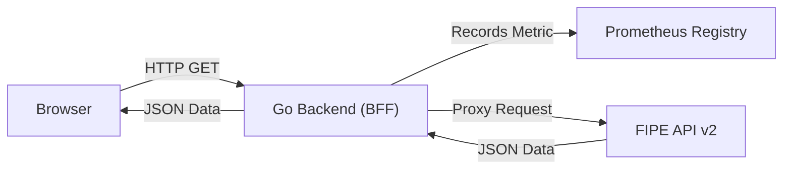
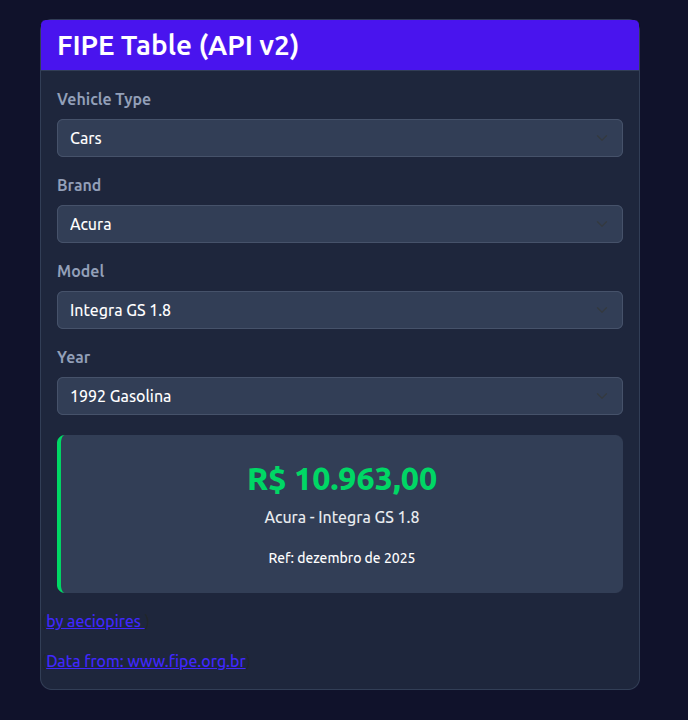

# gofipe

<!-- TOC -->

- [gofipe](#gofipe)
- [Introduction](#introduction)
- [Architecture](#architecture)
  - [Features](#features)
    - [API Endpoints](#api-endpoints)
    - [Metrics Documentation](#metrics-documentation)
- [Running using Docker](#running-using-docker)
- [Running locally without Docker](#running-locally-without-docker)
- [Build image](#build-image)
- [Developers](#developers)
- [License](#license)

<!-- TOC -->

# Introduction

A web application that provides a user-friendly interface to search the Brazilian FIPE vehicle price table.

References:
- https://www.fipe.org.br
- https://fipe.online/docs/comece-aqui

It implements a Backend in [Go](https://go.dev/) (acting as a proxy to the [FIPE data source](https://fipe.online/docs/api/fipe) and serving the Frontend), a simple Frontend using Go HTML Templates, [Prometheus](https://prometheus.io) metrics, and [Docker](https://docs.docker.com/get-started/) configurations.

# Architecture

To fulfill the requirement of tracking specific metrics (like "most searched model"), the Backend acts as a **BFF (Backend for Frontend)** [[1](https://medium.com/digitalproductsdev/arquitetura-bff-back-end-for-front-end-13e2cbfbcda2)] and [[2](https://dev.to/abdulnasirolcan/backend-for-frontend-bff-architecture-4p11)].

- **Frontend**: A server-side rendered [HTML](https://www.w3schools.com/html/) template (``templates/index.html``) served by Go. It uses [Vanilla JS](http://vanilla-js.com/) to fetch data from the Go backend.
- **Backend**: Written in Go. It exposes a clean internal API that mirrors the FIPE structure.
- **Observability**: Uses [prometheus/client_golang](https://github.com/prometheus/client_golang) to expose system and business metrics.

> Note: I am using the public API https://parallelum.com.br/fipe/api/v2 for this implementation. It is the community standard for FIPE data in Brazil, is free, requires no API keys, and uses the standard REST structure (Brands > Models > Years).

- The Browser calls the Go Backend.
- The Go Backend records the Prometheus metrics.
- The Go Backend forwards the request to the public [FIPE API](https://fipe.online/docs/api/fipe)).



## Features

- **FIPE API v2 Integration**: Fully compatible with the latest FIPE API endpoints (English parameters).
- **BFF Proxy**: Hides external API details from the frontend and handles CORS/Rate-limiting strategies centrally.
- **Static assets split**: frontend CSS and JS are now served from `/static/` for better structure and caching.
- **Theme support**: day/night layout with a client-side toggle.
- **Price history**: new endpoint `/api/priceHistory` and frontend UI to show price history for the last 12 months (configurable months).
- **Smart cache**: backend caches brands/models/years to reduce external API calls.
- **Parallel requests**: backend uses concurrent HTTP fetches internally where applicable.
- **Robust errors**: improved error handling and HTTP status codes for external failures.
- **Health Check**: dedicated ``/health`` endpoint for Kubernetes/Docker probes.
- **Prometheus Metrics**:
  - **Standard Go HTTP metrics** (request count, latency).
  - **Custom Business Metrics**: Tracks specific searches by Brand, Model, and Year.
- **Dockerized**: ready to deploy with [docker-compose](https://docs.docker.com/compose/).
- **Helm chart**: ready to deploy in Kubernetes cluster with [helm](https://helm.sh/).
- **Makefile**: to create simple builds and run containers for local development.

### API Endpoints

The backend exposes the following endpoints:

**System Endpoints**

|Method | Endpoint | Description |
|-------|----------|-------------| 
| ``GET`` | ``/health`` | Returns ``200 OK`` ``{"status": "ok"}`` if the app is running. |
| ``GET`` | ``/metrics`` | Exposes data in Prometheus format. |
| ``GET`` | ``/static`` | Exposes static assets. |

**Business API (Proxy)**

These endpoints proxy requests to https://fipe.parallelum.com.br/api/v2.

|Method | Endpoint | Params (Query String) | Description |
|-------|----------|-----------------------|-------------| 
| ``GET`` | ``/api/brands`` | ``type`` (cars, motorcycles, trucks) | Lists vehicle brands.| 
| ``GET`` | ``/api/models`` | ``type``, ``brandId`` | Lists models for a brand.|
| ``GET`` | ``/api/years`` | ``type``, ``brandId``, ``modelId`` | Lists available years for a model.|
| ``GET`` | ``/api/price`` | ``type``, ``brandId``, ``modelId``, ``yearId`` | (**Critical**) Returns the price and increments the search counter metric. |
| ``GET`` | ``/api/priceHistory`` | ``type``, ``brandId``, ``modelId``, ``yearId`` | Returns the price history for the last 12 months. |


### Metrics Documentation

The application exposes the following Prometheus metrics at ``/metrics`` endpoint:

- **Metric**: ``fipe_http_requests_total``:
   - **Type**: Counter
   - **Description**: Total number of HTTP requests processed by the server.
   - **Labels**: 
     - ``path``: The path of the HTTP request (e.g., ``/api/brands``).
     - ``method``: The HTTP method used (e.g., ``GET``).
- **Metric**: ``fipe_search_stats``:
  - **Type**: Counter
  - **Description**: Tracks the specific vehicles users are searching for. This is the core business metric.
  - **Labels**: 
    - ``brand_name``: Name of the brand (e.g., "Ford").
    - ``model_name``: Name of the model (e.g., "Fiesta 1.6").
    - ``year_id``: The year code (e.g., "2014-1").
- **Metric**: ``fipe_price_min``
  - **Type**: Gauge
  - **Description**: Minimum observed price recorded for a specific search (brand, model, year). This is updated when price data is successfully parsed from the external FIPE response.
  - **Labels**:
    - ``brand_name``
    - ``model_name``
    - ``year_id``

- **Metric**: ``fipe_price_max``
  - **Type**: Gauge
  - **Description**: Maximum observed price recorded for a specific search (brand, model, year). This is updated when price data is successfully parsed from the external FIPE response.
  - **Labels**:
    - ``brand_name``
    - ``model_name``
    - ``year_id``

- **Metric**: ``fipe_fuel_count``
  - **Type**: Counter
  - **Description**: Counts searches by fuel type as reported by the FIPE response (e.g., "Gasoline", "Alcohol"). Useful to understand distribution of fuel types across searches.
  - **Labels**:
    - ``fuel``

- **Metric**: ``fipe_brand_search_count``
  - **Type**: Counter
  - **Description**: Counts searches grouped by brand name. Useful to quickly surface the most searched brands.
  - **Labels**:
    - ``brand_name``

**Example**:

```plain
# HELP fipe_search_stats Counter for specific vehicle searches by brand, model, and year
# TYPE fipe_search_stats counter
fipe_search_stats{brand_name="Audi",model_name="A3 1.8 Turbo 3p",year_id="2004-1"} 1
fipe_search_stats{brand_name="VW - VolksWagen",model_name="GOL 1.0",year_id="2010-1"} 3
```

Prometheus Query to find the top 5 most searched 

```promql
topk(5, sum(fipe_search_stats) by (model_name))
```

# Running using Docker

Install Docker: https://docs.docker.com/get-started/get-docker/ 

Run the container

```bash
docker run -d -p 8080:8080 --rm --name gofipe aeciopires/gofipe:2.0.0
```

Access the application:
- UI: Open http://localhost:8080
- Metrics: Open http://localhost:8080/metrics.
- Health: Open http://localhost:8080/health.



You can change the default port using an environment variable.

```bash
docker run -p 3000:3000 -e PORT=3000 --rm --name gofipe aeciopires/gofipe:2.0.0
```

Access the application at http://localhost:3000.

# Running locally without Docker

Install Golang (1.25+): https://go.dev/doc/install

Run the application:

```bash
cd app
go mod init gofipe
go run main.go
```

Access the application at http://localhost:8080.

# Build image

Requirements:
- Install make (https://www.gnu.org/software/make/)
- Install Docker (https://docs.docker.com/get-started/get-docker/)
- Install Golang (1.25+): (https://go.dev/doc/install)

Run the command.

```bash
cd app
make image
```

# Developers

Aécio dos Santos Pires<br>
https://linktr.ee/aeciopires

# License

GPL-3.0 2025 Aécio dos Santos Pires